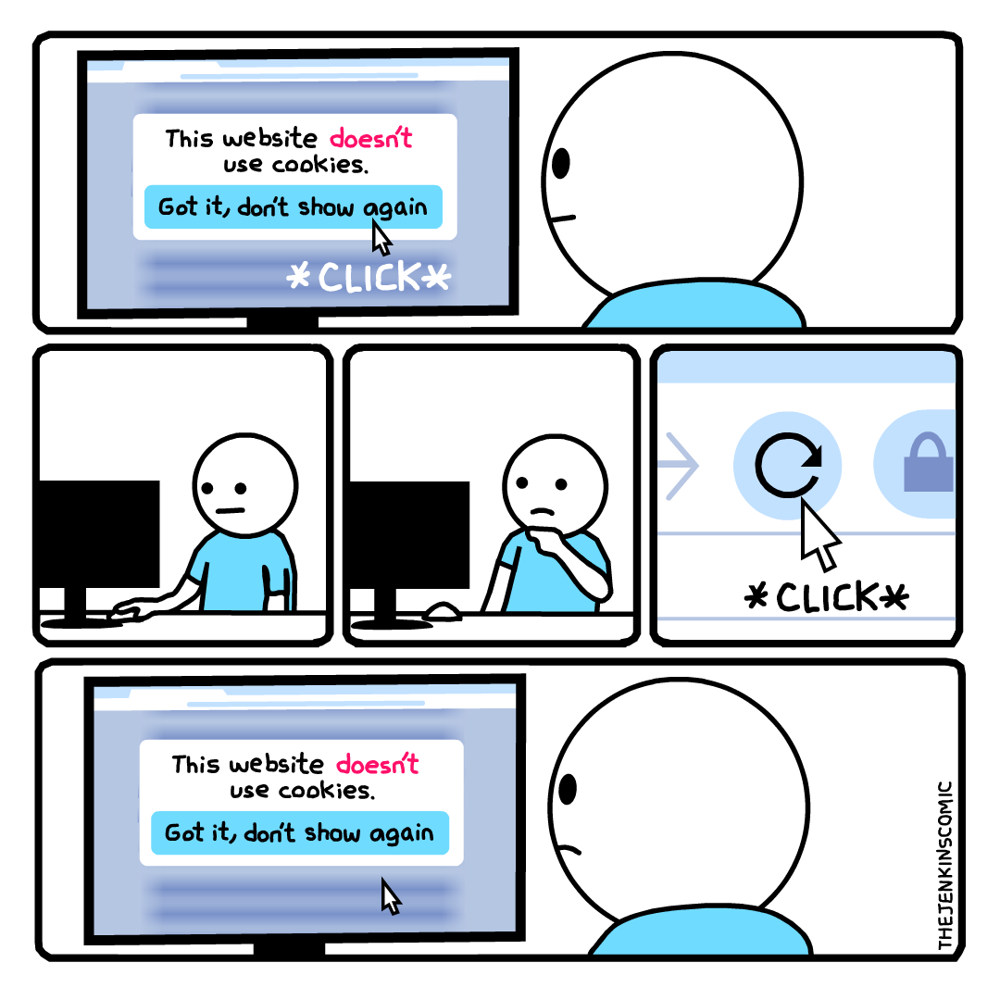

In your groups, answer the following questions.
No need to report the answers to me --
this is just for practice.
We may not get through all of the questions every week.
You may want to take notes during the discussion,
because these questions will be helpful in reviewing for exams.

I will be dropping in and out of rooms to facilitate to the discussions and in
case you have any questions.
Think of it like me walking around the classroom and listening to different
groups.
Again, this isn't meant to be for a grade,
so don't be concerned about giving a wrong answer even if I am in the room.
You can also flag me down in Zoom if you have a question even if I'm not in the
room
(I think the button in Zoom looks like a question mark).

Note: some questions are taken entirely or in part from your textbook.

# General Questions

1. Explain the difference between the internet and the world-wide web.

2. Give a few examples of objects that could be returned in an HTTP response.

3. HTML is the markup language used to format web pages.
Browsers read HTML files and display websites on your screen according to the
HTML description.
Describe the relationship between HTTP and HTML --
specifically, how are they different?
(We did not discuss HTML specifically in lecture.)

4. Why is a laptop not a good choice for running a web server?
(It could be done, but some characteristics of laptops generally make them
unsuitable for the purpose.)

5. Applications on the internet always run at the edge of the network.
What are some advantages of structuring the network this way?

6. Imagine I have an old desktop in my house that I call a web server.
This terminology is common, but a little imprecise.
Why? (Hint: why do we need port numbers?)

7. What happens if I send an HTTP request to port 81 by accident?

8. What is wrong with the following statement:
The application layer depends on the transport layer to deliver messages
between two computers.

9. What is the purpose of the `content-length` header?
Not all headers are required for all messages.
Would you expect this header to be required for HTTP requests, responses,
both, or neither?
Why?

10. Break the address `http://cis.gvsu.edu/~bowmnath/index.html` into a
hostname and a path.

11. A new open-source web server decided that using ASCII text to transfer
HTTP was too limiting.
Instead, it treats all incoming messages as though they were encoded in UTF-16.
Why might this not work well?
(You don't need to know the details of ASCII or UTF-16 to answer this,
but you do need to know the general gist of what they are.)

12. Does HTTP's limitation to ASCII text mean that it is not suitable for
serving content in languages that require additional symbols?
Why or why not?

13. If you have a program, such as `netcat`,
that opens a TCP connection to a specific port on a specific host,
then you can implement text-based protocols like HTTP by simply typing in the
appropriate messages.
Explain how this relates to the internet's layered architecture.

14. In the HTTP lab, you will use or have used `netcat` to send messages back
and forth with an HTTP server on the internet.
These messages were a bit tedious to type out by hand.
If you wrote a script to send the messages for you,
what type of common application would you have (partially) implemented?

15. A hypothetical web page consists of 4 total objects.
Each object takes `T_obj` to transmit.
Assuming a persistent connection is used,
how long will it take to download the entire web page from the moment the
request is sent?
Give your answer in terms of round-trip time (RTT) and `T_obj`.

16. Why does an HTTP server specify a last-modified date for a file?

17. Explain this statement:
Tracking a user with cookies requires the consent of the user's web browser.

18. Explain the joke in the comic below.

19. If internet protocols were to restrict packet sizes to be extremely small,
would this have more of an impact on transmission delay or propagation delay?

20. Traffic density on the access link between a network and the internet is
currently 0.8.
Since the density is less than 1,
the administrator decides to save money by reducing the bandwidth of that link.
Give a few reasons this might be a bad idea.

21. You recently purchased a new wireless router for your apartment that allows
you to transfer several gigabits per second on your local network.
Why will you not necessarily see faster download times from YouTube?

22. In the web cache example from lecture,
the average access time when using a cache on a busy network was actually less
than the time it would take to download a web page when the network was
completely uncongested but did not have a cache.
Explain how this is possible.
