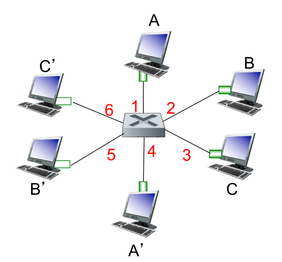

# General Questions

1. Assume all physical media involved and all Ethernet adapters involved on a
   particular subnet run 100 Mbps Ethernet.
   Which will generally result in a higher effective throughput on the subnet?
   * bus-based Ethernet
   * switched Ethernet

   Why?

2. Ethernet includes a cyclic redundancy check for bit errors.
   Given that, is Ethernet considered a reliable protocol?
   Why or why not?

3. What is the purpose of the `type` field in the Ethernet header?
   What would be the analogous field in a transport layer header?

4. Ethernet can be considered both a ____-layer and a ____-layer protocol.

5. You take a job doing office work for a small company with 8 other employees.
   You boss hands you a memo to give to Tom,
   but you have no idea who Tom is.
   To make matters worse,
   the office doors in the company are not labeled with people's names because
   they just moved to a new building.
   So, you make 7 copies and give them to everyone besides your boss herself.
   Eventually, Tom sends a memo to Pam,
   and you make a note of which office Tom came out of so that you can send
   future messages directed at Tom directly to his office.
   What is the networking equivalent of the system you have set up?

6. Consider the office scenario above.
   Would this system work better in an office with 8 employees or 800
   employees?
   Why?

7. In the office scenario,
   if the memo simply read
   "Buy 100 reams of paper"
   with no other text,
   would you want to add additional information to it before making copies and
   sending them?
   Why or why not?
   Would the networking equivalent of you as the "secretary" need to worry
   about this?

For the next few questions,
consider the following image taken from the slides provided by the textbook
authors.
Note that the hosts are connected via a *switch*,
not a router.

8. Consider the following statement:

   Before host A can send to host C,
   it must learn the MAC address of interface 1 of the switch.

   If this is true,
   how does A learn the MAC address?
   If not, why not?

9. Assume all other hosts want to send to A at the same time.
   If the network is running 100 Mbps Ethernet,
   what is the rate at which data is received by A?

10. Give a few similarities and differences between a switch table and a routing
    table.

11. In the diagram above,
    if B wanted to read frames meant for A,
    how could it trick the switch into sending those frames to B?

12. Why is the issue raised in the previous question typically not considered
    a problem in practice?
    (I.e., why do we not worry much about defending against this "attack"?)

13. Assume the switching table for the network above is initially empty.
    Host A sends to host B, then host B sends to host C.
    What does the switching table look like after this process is complete?

14. Give a disadvantage of having a very large switched-Ethernet LAN.

15. Consider the two scenarios below.
    Explain which is more similar to ARP and which is more similar to a
    self-learning switch and why.
    * Scenario A: You are playing soccer (football) on a new team.
      The play calls for you to pass to Lionel.
      You shout their name ("Hey Lionel!") because you do not know their
      jersey number.
      Lionel responds with their number ("I'm #10!"),
      and from that point on whenever you are supposed to pass to Lionel,
      you pass to #10.
    * Scenario B: You are a teaching assistant tasked with passing messages
      between students and the professor during exams.
      When a student passes a note to the professor,
      you glance at the student's name on the note and record which seat they
      are sitting in in case the professor writes a note back that you need
      to deliver.

16. Describe in general the similarities and differences between ARP and a
    self-learning switch.
    Consider both how they learn and their purpose.

17. Unlike most previous protocols we have seen,
    Ethernet specifies both header *and* footer information that should be
    attached to a message.
    However, the Ethernet header does not contain any information about
    message length.
    How does the Ethernet receiver know when the payload ends and the footer
    begins?
    (Note: this is something that Ethernet handles itself --
    it does not look at the higher-layer package to determine the length of
    the data.)
